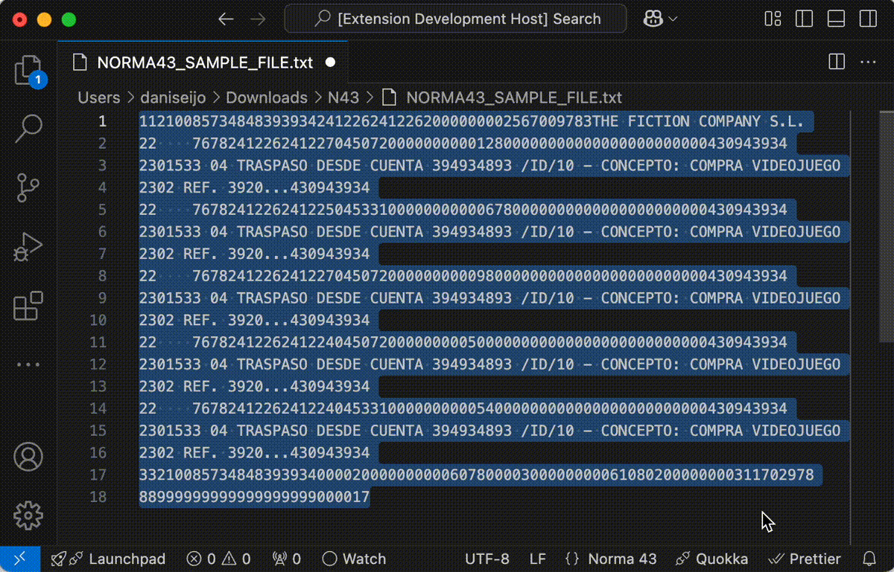

## Norma43 formatter for Visual Studio Code

This extension is intended to color highlight and format correctly files containing registries compliant with the [Norma 43 standard](https://www.caixabank.es/deployedfiles/empresas/Estaticos/pdf/Transferenciasyficheros/q43Junio2012.pdf).

## Features

The extension will format the file by adding spaces to the end of lines that are not complete to the standard width of 80 characters.

Once the file is formatted, the extension will highlight the lines with colors for a better readability of the different sections of each line.

## Release Notes

### 1.0.2

- Fix amount calculation for account end Debit/Credit records.

### 1.0.1

- Fix debit / credit amount calculation.

### 1.0.0

- Add hovering information for each registry.

### 0.0.1

Initial release of the extension.